# Taywan Queiroz

**`Desenvolvedor Front-end e Java`**

Sou estudante de Ciência da Computação, atualmente no 2º semestre, com foco em desenvolvimento de software e interesse nas áreas de Desenvolvimento Front-end e Back-end com Java.

Neste GitHub compartilho projetos, estudos e experimentos desenvolvidos ao longo da minha jornada de aprendizado. Aqui você encontrará aplicações criadas com HTML, CSS e JavaScript, além de projetos voltados ao meu aprendizado em Java, SQL e outras tecnologias que fazem parte da minha formação.

Tenho como objetivo evoluir continuamente minhas habilidades técnicas, escrever código limpo e bem estruturado e desenvolver soluções que unam desempenho, organização e boas práticas de programação.

Estou sempre em busca de novos desafios, aprimorando meus conhecimentos por meio de projetos práticos, estudos constantes e aprendizado contínuo, preparando-me para atuar profissionalmente no desenvolvimento de software.

---

### 🤖 Linguagens e Tecnologias

 
 

### 📊 Estatísticas

  

  

